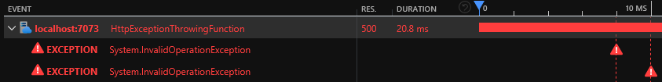

# Azure Functions Limitations

This project demonstrates the limitations of the Application Insights integration with Azure Functions `v3` and `v4`. This repository is supporting the blog post I wrote about [Azure Functions and their limitations][blog-post].

## Prerequisites

- [Azurite][azurite] is used as the Azure blob emulator
- [Azure Functions Core Tools v4][azure-functions-core-tools] if you want to run from the command line
- [Powershell 7][powershell-7] to deploy to Azure
- [Azure PowerShell][azure-powershell] to deploy to Azure

## Software versions

I used the Azure Functions Core Tools version `3.0.3160` to create the Function App (released on the 9th of December 2020). The latest version of the Azure Functions Core Tools I've been using is `4.0.3971`.

NuGet packages:

- `Microsoft.NET.Sdk.Functions`:
  - `v3`: `3.0.13` (added automatically when creating the Function, updated later)
  - `v4`: `4.0.1` (added automatically when creating the Function)
- `Microsoft.Azure.Functions.Extensions`: `1.1.0` (added manually following [Use dependency injection in .NET Azure Functions][dependency-injection])
- `Microsoft.Extensions.DependencyInjection` (added manually following [Use dependency injection in .NET Azure Functions][dependency-injection]):
  - `v3`: `3.1.22`
  - `v4`: `6.0.0`
- `Microsoft.Azure.WebJobs.Logging.ApplicationInsights`: `3.0.30` (added manually following [Log custom telemetry in C# functions][custom-telemetry])

## Getting started

Run `deploy.ps1` to deploy the project to Azure. This will deploy:

- A Workspace based Application Insights instance
- A Service Bus namespace
- Four Function Apps and their supporting storage accounts

```powershell
.\deploy.ps1 -Location {AzureRegion} -ResourceNamePrefix {UniquePrefix}
```

## Function Apps

- `DefaultV3InProcessFunction` and `DefaultV4InProcessFunction` demonstrate the limitations of In-Process Azure Functions `v3` / `v4` Application Insights integration
- `CustomV3InProcessFunction` and `CustomV4InProcessFunction` demonstrate the workarounds I use to improve In-Process Azure Functions `v3` / `v4` Application Insights integration

I've decided to commit the `local.settings.json` file. This is not the default or recommended approach but it makes it easier for new joiners to get started.

You'll need to set the Application Insights connection string:

```powershell
dotnet user-secrets set APPLICATIONINSIGHTS_CONNECTION_STRING "{YourConnectionString}" --id 074ca336-270b-4832-9a1a-60baf152b727
```

### Default In-Process V3 and V4 Function Apps

You can start the Function Apps by issuing the below commands:

```powershell
cd .\samples\DefaultV3InProcessFunction\
func start
```

```powershell
cd .\samples\DefaultV4InProcessFunction\
func start
```

The Function Apps run on fixed ports locally:

- `v3`: `7071`
- `v4`: `7073`

#### Default In-Process V4 - HttpExceptionThrowingFunction

Navigate to `http://localhost:7073/api/exception` in your favourite browser.

Demonstrates that the stack trace is not present in the console logs when an exception is thrown.


This also demonstrates that the same exception appears twice in Application Insights:



#### Default In-Process V4 - CustomEventFunction

Navigate to `http://localhost:7073/api/event` in your favourite browser.

Demonstrate that when the setting `APPINSIGHTS_INSTRUMENTATIONKEY` / `APPLICATIONINSIGHTS_CONNECTION_STRING` is not set, attempting to retrieve `TelemetryConfiguration` from the container results in an exception:


Note: when using vanilla ASP.NET, `TelemetryConfiguration` is registered by calling `AddApplicationInsightsTelemetry()` in `Startup.cs` but this method [should not be called in Azure Functions][dont-call-add-app-insights-telemetry]:

> Don't add `AddApplicationInsightsTelemetry()` to the services collection, which registers services that conflict with services provided by the environment.

#### Default In-Process V4 - ProcessorFunction

Navigate to `http://localhost:7073/api/processor` in your favourite browser.

Demonstrates that our telemetry processor is not being called even though we added it using `AddApplicationInsightsTelemetryProcessor`.


#### Default In-Process V4 - UserSecretFunction

Navigate to `http://localhost:7073/api/secret` in your favourite browser.

Demonstrates that Azure Functions can use the [Secret Manager][secret-manager] when running locally.

#### Default In-Process V4 - TraceLogFunction

Navigate to `http://localhost:7073/api/trace-log` in your favourite browser.

Demonstrate that log events are not filtered before being sent to Live Metrics. This is not a limitation of Azure Functions, that's how Application Insights works and something you need to be aware of.


#### Default In-Process V4 - ServiceBusExceptionThrowingFunction

You can send a message to the `defaultv4inprocess-exception-queue` queue using the Service Bus Explorer in the Azure Portal or you can navigate to `http://localhost:7073/api/service-bus-exception` in your favourite browser.

Demonstrate that a single exception thrown by the Function is recorded three times in Application Insights and that a total of eight telemetry items are emitted during the Function execution.


### Custom In-Process V3 and V4 Function Apps

You can start the Function Apps by issuing the below commands:

```powershell
cd .\samples\CustomV3InProcessFunction\
func start
```

```powershell
cd .\samples\CustomV4InProcessFunction\
func start
```

The Function Apps run on fixed ports locally:

- `v3`: `7072`
- `v4`: `7074`

### Custom In-Process V4 - HttpExceptionThrowingFunction

Navigate to `http://localhost:7074/api/exception` in your favourite browser.

Demonstrates that the stack trace is present in the console logs when an exception is thrown.


This also demonstrates that the same exception appears only once in Application Insights:


#### Custom In-Process V4 - CustomEventFunction

Navigate to `http://localhost:7074/api/event` in your favourite browser.

Demonstrate that when the setting `APPINSIGHTS_INSTRUMENTATIONKEY` / `APPLICATIONINSIGHTS_CONNECTION_STRING` is not set, attempting to retrieve `TelemetryConfiguration` from the container does not result in an exception because I [register a no-op TelemetryConfiguration][default-telemetry-configuration-registration] if one was not registered already:


#### Custom In-Process V4 - ProcessorFunction

Navigate to `http://localhost:7074/api/processor` in your favourite browser.

Demonstrates that our `TelemetryCounter` telemetry processor is being called:


Note that the processor is also called for request telemetry items.

#### Custom In-Process V4 - ServiceBusExceptionThrowingFunction

You can send a message to the `customv4inprocess-exception-queue` queue using the Service Bus Explorer in the Azure Portal or you can navigate to `http://localhost:7074/api/service-bus-exception` in your favourite browser.

Demonstrate that a single exception thrown by the Function is recorded only once in Application Insights and that a total of two telemetry items are emitted during the Function execution.


I'm also setting the "request" `URL` and "response" code using `ServiceBusRequestInitializer`.

#### Custom In-Process V4 - AvailabilityFunction

Navigate to `http://localhost:7074/api/availability` in your favourite browser.

Emits an availability telemetry items. This is normally emitted by tooling such as Application Insights [URL ping test][url-ping-test]. The reason I'm emitting it manually is to demonstrate that the processor is called for availability telemetry items.

#### Custom In-Process V4 - DependencyFunction

Navigate to `http://localhost:7074/api/dependency` in your favourite browser.

Discards a specific telemetry type. This is useful when having a noisy telemetry. You can tweak the processor to only discard successful dependencies, you can also modify the implementation to discard multiple dependency types.

[azurite]: https://docs.microsoft.com/en-us/azure/storage/common/storage-use-azurite
[azure-functions-core-tools]: https://github.com/Azure/azure-functions-core-tools
[dependency-injection]: https://docs.microsoft.com/en-us/azure/azure-functions/functions-dotnet-dependency-injection
[custom-telemetry]: https://docs.microsoft.com/en-us/azure/azure-functions/functions-dotnet-class-library?tabs=v2%2Ccmd#log-custom-telemetry-in-c-functions
[powershell-7]: https://docs.microsoft.com/en-us/powershell/scripting/install/installing-powershell-on-windows?view=powershell-7.2
[azure-powershell]: https://docs.microsoft.com/en-us/powershell/azure/install-az-ps?view=azps-7.1.0
[dont-call-add-app-insights-telemetry]: https://docs.microsoft.com/en-US/azure/azure-functions/functions-dotnet-dependency-injection#logging-services
[secret-manager]: https://docs.microsoft.com/en-us/aspnet/core/security/app-secrets?view=aspnetcore-6.0&tabs=windows#secret-manager
[blog-post]: https://gabrielweyer.net/2020/12/20/azure-functions-and-their-limitations/
[default-telemetry-configuration-registration]: https://github.com/gabrielweyer/azure-functions-limitations/blob/4f5f212a5c5e3ce067d23eb564ba24655999f918/src/Custom.FunctionsTelemetry/ApplicationInsights/ApplicationInsightsServiceCollectionExtensions.cs#L212-L216
[url-ping-test]: https://docs.microsoft.com/en-us/azure/azure-monitor/app/availability-overview
