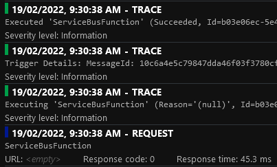
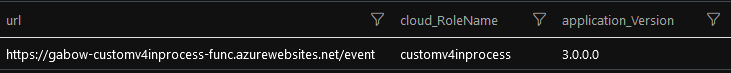
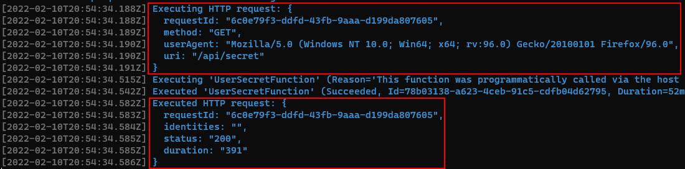

# Azure Functions Telemetry

The Application Insights integration for Azure Functions `v3` and `v4` suffers from a few quirks that can lead to a huge Application Insights bill:

- Telemetry processors are not supported, preventing developers from discarding telemetry items
- Each Function execution records a trace when starting and on completion
- Exceptions are logged twice for the HTTP binding
- Exceptions are logged three times for the Service Bus binding

The next issue has no impact on the cost of Application Insights but rather is related to the development experience. `TelemetryConfiguration` is not registered in the Inversion Of Control container when the Application Insights connection string is not set. Emitting a custom metric requires to inject the `TelemetryConfiguration`. Running locally without having configured the Application Insights connection string will then result in an exception.

The last issue is not related to Application Insights but also negatively impact developers' productivity. The custom Console logger provider used by the Azure Functions runtime does not include the stack trace when displaying an exception (for the HTTP binding at least).

If you’re not familiar with some of the more advanced features of Application Insights, I suggest you go through the below references before reading the rest of this document:

- [Telemetry processors][telemetry-processors]
- [Telemetry initializers][telemetry-initializers]

In this repository I've attempted to address all the quirks listed above.

:rotating_light: The customisation is experimental. There may be undesired side effects around performance and missing telemetry. If you're experiencing issues such as missing telemetry, no exception being recorded when something doesn't work as expected I recommend disabling the custom integration and reproducing the problem without it.

## Using the Application Insights customisation

The customisation supports both `v3` and `v4` runtime.

Copy the `src/AzureFunctionsTelemetry` project into your solution and reference it from your Function App(s). You can get the latest version by copying the updated files over yours.

:memo: I haven’t packaged the library into a `NuGet` package yet as the customisation is only used in a few Functions so far. Create an issue if you would like to consume a `NuGet` package.

For the most basic integration, you need to provide:

- `{ApplicationName}` used to set Application Insights' _Cloud role name_
- `{TypeFromEntryAssembly}` typically would be `typeof(Startup)`. I read the [Assembly Informational Version][assembly-informational-version] of the entry assembly to set Application Insights' _Application version_

In your `Startup` `class` add the below snippet:

```csharp
var appInsightsOptions = new CustomApplicationInsightsOptionsBuilder(
        "{ApplicationName}",
        {TypeFromEntryAssembly})
    .Build();

builder.Services
    .AddCustomApplicationInsights(appInsightsOptions)
    .AddCustomConsoleLogging();
```

The snippet above is catered for a Function App containing only HTTP bindings. When your Function contains only Service Bus bindings, you’ll want to use the below snippet:

```csharp
var appInsightsOptions = new CustomApplicationInsightsOptionsBuilder(
        "{ApplicationName}",
        {TypeFromEntryAssembly})
    .WithServiceBusTriggerFilter()
    .Build();

builder.Services
    .AddCustomApplicationInsights(appInsightsOptions)
    .AddCustomConsoleLogging();
```

I also support Function Apps containing both HTTP and Service Bus bindings. You can mix and match the snippets above.

## What do I get?

### Discarding Function execution traces

This is implemented by [FunctionExecutionTracesFilter][function-execution-traces-filter] and always enabled.

### Discarding duplicate exceptions

This is implemented by [DuplicateExceptionsFilter][duplicate-exceptions-filter].

### Discarding health requests

This is enabled by calling `WithHealthRequestFilter` and providing the Function name (the argument provided to the `FunctionNameAttribute`). The telemetry processor used is [HealthRequestFilter][health-request-filter].

### Better Service Bus binding "request"

The _request name_ and _status code_ are not being set on the service bus triggered "requests". The [ServiceBusRequestInitializer][service-bus-request-initializer] can do this for you.

- Request name: I use the Function name
- Status code: `200` in case of success, `500` in case of failure

The `ServiceBusRequestInitializer` is always enabled.

### Discarding Service Bus trigger traces

This is recommended on high-volume services. This is done by calling `WithServiceBusTriggerFilter`. The telemetry processor used is [ServiceBusTriggerFilter][service-bus-trigger-filter].

### Replacing the Console logging provider

This is done by calling `AddCustomConsoleLogging`. You’ll then consistently get stack traces in the console.

### Registering telemetry initializers

:memo: The built-in integration supports telemetry initializers. The custom integration supports registering telemetry initializers in the same way than the built-in integration does.

Telemetry initializers can either be registered using `TImplementation`:

```csharp
builder.Services.AddSingleton<ITelemetryInitializer, YourInitializer>();
```

Or an instance of the telemetry initializer:

```csharp
// Use:
builder.Services.AddSingleton<ITelemetryInitializer>(new YourOtherInitializer("NiceValue"));
// Do not use, otherwise your telemetry initializer will not be called:
builder.Services.AddSingleton(new YourOtherInitializer("NiceValue"));
```

You can add as many telemetry initializers as you want.

### Telemetry processors support

:memo: The built-in integration does **not** support telemetry processors. I've added support so that you can use the same extension method than when registering a telemetry processor in ASP.NET Core:

```csharp
builder.Services.AddApplicationInsightsTelemetryProcessor<YourTelemetryProcessor>();
```

You can add as many telemetry processors as you want.

## Demo

The demo requires an Azure Service Bus namespace to run. Functions can run both locally and in Azure, when running locally I recommend to stop the Functions deployed in Azure otherwise the Service Bus triggers will compete for messages.

Before being able to deploy and run the Functions you'll need to have the below software installed:

- [Azurite][azurite] is used as the Azure blob emulator when running locally
- [Azure Functions Core Tools v4][azure-functions-core-tools] if you want to run from the command line (you'll need the `v4` version if you want to be able to run the `v4` Functions locally)
- [Powershell 7][powershell-7] to deploy to Azure
- [Azure PowerShell][azure-powershell] to deploy to Azure

Run `deploy.ps1` to deploy the project to Azure. This will deploy:

- A Workspace based Application Insights instance
- A Service Bus namespace
- Four Function Apps and their supporting storage accounts

```powershell
.\deploy.ps1 -Location {AzureRegion} -ResourceNamePrefix {UniquePrefix}
```

The project contains four Functions Apps:

- `DefaultV3InProcessFunction` and `DefaultV4InProcessFunction` demonstrate the quirks of In-Process Azure Functions `v3` / `v4` Application Insights integration
- `CustomV3InProcessFunction` and `CustomV4InProcessFunction` demonstrate the workarounds I use to improve In-Process Azure Functions `v3` / `v4` Application Insights integration

I've decided to commit the `local.settings.json` file. This is **not the default or recommended approach** but it makes it easier for new joiners to get started.

You can start the Function Apps by issuing the below commands:

```powershell
cd .\samples\DefaultV3InProcessFunction\
func start
```

```powershell
cd .\samples\DefaultV4InProcessFunction\
func start
```

```powershell
cd .\samples\CustomV3InProcessFunction\
func start
```

```powershell
cd .\samples\CustomV4InProcessFunction\
func start
```

The Function Apps run on fixed ports locally so that you can run all four Functions at the same time:

- Default `v3`: `7071`
- Default `v4`: `7073`
- Custom `v3`: `7072`
- Custom `v4`: `7074`

You can call the different endpoints using this [Postman collection][postman-collection].

### AvailabilityFunction

Navigate to `http://localhost:7074/availability` (Custom `v4`) in your favourite browser.

Emits an availability telemetry item. This is normally emitted by tooling such as Application Insights [URL ping test][url-ping-test]. The reason I'm emitting it manually is to demonstrate that the telemetry processors are called for availability telemetry items.

### CustomEventFunction

You'll need to delete the Application Insights connection string secret in order to reproduce the error. Stop all the Functions and then run:

```powershell
dotnet user-secrets list --id 074ca336-270b-4832-9a1a-60baf152b727
```

Make a note of the value of the `APPLICATIONINSIGHTS_CONNECTION_STRING` secret, then delete it:

```powershell
dotnet user-secrets remove APPLICATIONINSIGHTS_CONNECTION_STRING `
    --id 074ca336-270b-4832-9a1a-60baf152b727
```

Finally once done, you can add the secret again:

```powershell
dotnet user-secrets set APPLICATIONINSIGHTS_CONNECTION_STRING '{YourConnectionString}' `
    --id 074ca336-270b-4832-9a1a-60baf152b727
```

Navigate to `http://localhost:7073/event` (Default `v4`) in your favourite browser.

Demonstrate that when the secret `APPLICATIONINSIGHTS_CONNECTION_STRING` is not set, attempting to retrieve `TelemetryConfiguration` from the container results in an exception:


:memo: When using ASP.NET Core, `TelemetryConfiguration` is registered by calling `AddApplicationInsightsTelemetry()` in `Startup.cs` but this method [should not be called in Azure Functions][dont-call-add-app-insights-telemetry]:

> Don't add `AddApplicationInsightsTelemetry()` to the services collection, which registers services that conflict with services provided by the environment.

Navigate to `http://localhost:7074/event` (Custom `v4`) in your favourite browser.

Demonstrate that when the secret `APPLICATIONINSIGHTS_CONNECTION_STRING` is not set, attempting to retrieve `TelemetryConfiguration` from the container does not result in an exception because I [register a no-op TelemetryConfiguration][default-telemetry-configuration-registration] if one was not registered already:


### DependencyFunction

Navigate to `http://localhost:7073/dependency` (Default `v4`) in your favourite browser.

Four telemetry items are recorded:

- The request itself
- The _Executing ..._ and _Executed ..._ traces
- The custom dependency we've manually tracked


Navigate to `http://localhost:7074/dependency` (Custom `v4`) in your favourite browser.

Only the request is recorded:

- The _Executing ..._ and _Executed ..._ traces have been discarded by the `FunctionExecutionTracesFilter`
- The custom dependency we've manually tracked has been discarded by the `CustomHttpDependencyFilter`


The `CustomHttpDependencyFilter` discards a specific telemetry type. This is useful when having a noisy telemetry. You can tweak the processor to only discard successful dependencies.

### HealthFunction

To keep Function Apps on a consumption plan alive and limit the number of cold starts, developers tend to use Application Insights [URL ping test][url-ping-test]. This results in many requests being recorded in Application Insights.

:memo: `HEAD` is more commonly used than `GET` for ping tests but it's easier to issue a `GET` with a web browser.

Navigate to `http://localhost:7073/health` (Default `v4`) in your favourite browser.

The Health request is recorded in Application Insights.

Navigate to `http://localhost:7074/health` (Custom `v4`) in your favourite browser.

The Health request is discarded by the `HealthRequestFilter` which is configured by `WithHealthRequestFilter`.

### HttpExceptionThrowingFunction

Navigate to `http://localhost:7073/http-exception` (Default `v4`) in your favourite browser.

Demonstrates that the stack trace is not present in the console logs when an exception is thrown.


This also demonstrates that the same exception appears twice in Application Insights:


Navigate to `http://localhost:7074/http-exception` (Custom `v4`) in your favourite browser.

Demonstrates that the stack trace is present in the console logs when an exception is thrown.


This also demonstrates that the same exception appears only once in Application Insights:


### ProcessorFunction

Navigate to `http://localhost:7073/processor` (Default `v4`) in your favourite browser.

Demonstrates that our `TelemetryCounterProcessor` telemetry processor is not being called even though I added it using `AddApplicationInsightsTelemetryProcessor`.


Navigate to `http://localhost:7074/processor` (Custom `v4`) in your favourite browser.

Demonstrates that our `TelemetryCounterProcessor` telemetry processor is being called:


Note that the processor is also called for request telemetry items. When running in Azure you might get different results on each request as you might be hitting different instances and the state is kept in-memory.

### ServiceBusFunction

You can send a message to the `defaultv4inprocess-queue` queue using the Service Bus Explorer in the Azure Portal or you can navigate to `http://localhost:7073/service-bus` (Default `v4`) in your favourite browser.

The Default Function does not have a _Request URL_ or a _Response code_:


Four telemetry items are recorded for the Default Function execution:

- The request itself
- The _Executing ..._ and _Executed ..._ traces
- The _Trigger Details ..._ trace



You can send a message to the `customv4inprocess-queue` queue using the Service Bus Explorer in the Azure Portal or you can navigate to `http://localhost:7074/service-bus` (Custom `v4`) in your favourite browser.

The Custom Function has both the _Request URL_ and _Response code_ set by `ServiceBusRequestInitializer`:


Only the request is recorded for the Custom Function execution:

- The _Executing ..._ and _Executed ..._ traces have been discarded by the `FunctionExecutionTracesFilter`
- The _Trigger Details ..._ trace has been discarded by the `ServiceBusTriggerFilter`


### ServiceBusExceptionThrowingFunction

You can send a message to the `defaultv4inprocess-exception-queue` queue using the Service Bus Explorer in the Azure Portal or you can navigate to `http://localhost:7073/service-bus-exception` (Default `v4`) in your favourite browser.

Demonstrate that a single exception thrown by the Function is recorded three times in Application Insights and that a total of nine telemetry items are emitted during the Function execution.


You can send a message to the `customv4inprocess-exception-queue` queue using the Service Bus Explorer in the Azure Portal or you can navigate to `http://localhost:7074/service-bus-exception` (Custom `v4`) in your favourite browser.

Demonstrate that a single exception thrown by the Function is recorded only once in Application Insights and that a total of three telemetry items are emitted during the Function execution.


### TraceLogFunction

Navigate to `http://localhost:7073/trace-log` (Default `v4`) / `http://localhost:7074/trace-log` (Custom `v4`) in your favourite browser.

Demonstrate that log events are not filtered before being sent to Live Metrics. This is not a limitation of Azure Functions, that's how Application Insights works and something you need to be aware of.


### UserSecretFunction

Navigate to `http://localhost:7073/secret` (Default `v4`) / `http://localhost:7074/secret` (Custom `v4`) in your favourite browser.

Demonstrates that Azure Functions can use the [Secret Manager][secret-manager] when running locally.

### Application Version and Cloud Role Name

By default the _Application Version_ is not set and the _Cloud Role Name_ will be the Function App Azure resource name:


You can add a telemetry initializer to set the Application Version and Cloud Role Name.

For the custom Function, each telemetry will be stamped with the Assembly Informational Version and the configured application name:



### Discarding SystemTraceMiddleware logs

The `SystemTraceMiddleware` emits two log events per HTTP Function execution when running locally:



These can be suppressed by adding the below `Value` to `local.settings.json` (not `host.json`):

```json
"logging:logLevel:Microsoft.Azure.WebJobs.Script.WebHost.Middleware.SystemTraceMiddleware": "None"
```


Anthony Chu has [documented how to suppress some logs][anthony-chu-suppress-logs].

## Q&A

### Why so much code to support telemetry processors?

There is an [opened GitHub issue][telemetry-processor-support-github-issue] about the lack of telemetry processors support in Azure Functions. The thread provides a workaround to enable telemetry processors but the telemetry processors added in this fashion will not be called for request telemetry items.

## Appendix

### Software versions

I used the Azure Functions Core Tools version `3.0.3160` to create the Function App (released on the 9th of December 2020). The latest version of the Azure Functions Core Tools I've been using is `4.0.3971`.

NuGet packages:

- `Microsoft.NET.Sdk.Functions`:
  - `v3`: `3.0.13` (added automatically when creating the Function, updated later)
  - `v4`: `4.0.1` (added automatically when creating the Function)
- `Microsoft.Azure.Functions.Extensions`: `1.1.0` (added manually following [Use dependency injection in .NET Azure Functions][dependency-injection])
- `Microsoft.Extensions.DependencyInjection` (added manually following [Use dependency injection in .NET Azure Functions][dependency-injection]):
  - `v3`: `3.1.22`
  - `v4`: `6.0.0`
- `Microsoft.Azure.WebJobs.Logging.ApplicationInsights`: `3.0.30` (added manually following [Log custom telemetry in C# Azure Functions][custom-telemetry])

### Supporting telemetry processors

The code in `AddCustomApplicationInsights` retrieves the configured built-in telemetry processors, adds them to a new telemetry processor chain and builds the chain. This gives me the opportunity to add our own processors to the chain.

The first built-in processor in the chain is `OperationFilteringTelemetryProcessor`, this processor discards all the dependencies considered internal to the Azure Functions runtime (such as access to blob storage for the distributed lock and the calls to Azure Service Bus for the Service Bus binding).

One of the side-effect of the approach I'm using is that the Azure Functions runtime will reference the initial instance of `OperationFilteringTelemetryProcessor` and will call it directly when tracking requests manually. Normally the `OperationFilteringTelemetryProcessor` instance points to the second processor in the chain (`QuickPulseTelemetryProcessor`). One way for our processors to be called is to point the existing `OperationFilteringTelemetryProcessor` instance to our first processor and point our last processor to `QuickPulseTelemetryProcessor`. This is done through some pretty dodgy untested code but it works :tm:.

[azurite]: https://docs.microsoft.com/en-us/azure/storage/common/storage-use-azurite
[azure-functions-core-tools]: https://github.com/Azure/azure-functions-core-tools
[dependency-injection]: https://docs.microsoft.com/en-us/azure/azure-functions/functions-dotnet-dependency-injection
[custom-telemetry]: https://docs.microsoft.com/en-us/azure/azure-functions/functions-dotnet-class-library?tabs=v2%2Ccmd#log-custom-telemetry-in-c-functions
[powershell-7]: https://docs.microsoft.com/en-us/powershell/scripting/install/installing-powershell-on-windows?view=powershell-7.2
[azure-powershell]: https://docs.microsoft.com/en-us/powershell/azure/install-az-ps?view=azps-7.1.0
[dont-call-add-app-insights-telemetry]: https://docs.microsoft.com/en-US/azure/azure-functions/functions-dotnet-dependency-injection#logging-services
[secret-manager]: https://docs.microsoft.com/en-us/aspnet/core/security/app-secrets?view=aspnetcore-6.0&tabs=windows#secret-manager
[default-telemetry-configuration-registration]: https://github.com/gabrielweyer/azure-functions-telemetry/blob/81a44091df4263442bb0e205a3942cfa5bfedb70/src/AzureFunctionsTelemetry/ApplicationInsights/ApplicationInsightsServiceCollectionExtensions.cs#L231-L235
[url-ping-test]: https://docs.microsoft.com/en-us/azure/azure-monitor/app/availability-overview
[anthony-chu-suppress-logs]: https://github.com/anthonychu/functions-log-suppression#readme
[telemetry-processors]: https://docs.microsoft.com/en-us/azure/azure-monitor/app/api-filtering-sampling#filtering
[telemetry-initializers]: https://docs.microsoft.com/en-us/azure/azure-monitor/app/api-filtering-sampling#addmodify-properties-itelemetryinitializer
[assembly-informational-version]: https://docs.microsoft.com/en-us/dotnet/standard/assembly/versioning#assembly-informational-version
[function-execution-traces-filter]: https://github.com/gabrielweyer/azure-functions-telemetry/blob/main/src/AzureFunctionsTelemetry/ApplicationInsights/FunctionExecutionTracesFilter.cs
[duplicate-exceptions-filter]: https://github.com/gabrielweyer/azure-functions-telemetry/blob/main/src/AzureFunctionsTelemetry/ApplicationInsights/DuplicateExceptionsFilter.cs
[health-request-filter]: https://github.com/gabrielweyer/azure-functions-telemetry/blob/main/src/AzureFunctionsTelemetry/ApplicationInsights/HealthRequestFilter.cs
[service-bus-request-initializer]: https://github.com/gabrielweyer/azure-functions-telemetry/blob/main/src/AzureFunctionsTelemetry/ApplicationInsights/ServiceBusRequestInitializer.cs
[service-bus-trigger-filter]: https://github.com/gabrielweyer/azure-functions-telemetry/blob/main/src/AzureFunctionsTelemetry/ApplicationInsights/ServiceBusTriggerFilter.cs
[telemetry-processor-support-github-issue]: https://github.com/Azure/azure-functions-host/issues/3741
[postman-collection]: docs/postman/FunctionsTelemetry.postman_collection.json
