# Demo

The demo requires an Azure Service Bus namespace to run. Functions can run both locally and in Azure, when running locally I recommend stopping the Functions deployed in Azure otherwise the Service Bus triggers will compete for messages.

Before being able to deploy and run the Functions you will need to have the below software installed:

- [Azurite][azurite] is used as the Azure blob storage emulator when running locally
- [Azure Functions Core Tools v4][azure-functions-core-tools] if you want to run from the command line
- [Powershell 7][powershell-7] to deploy to Azure
- [Azure PowerShell][azure-powershell] to deploy to Azure
- [Bicep CLI][bicep-cli] to deploy to Azure

You'll first need to run `build.ps1 --package` to publish the Functions to file system.

Run `Deploy.ps1` to deploy the project to Azure. This will deploy:

- A Workspace based Application Insights instance
- A basic Service Bus namespace
- Five Function Apps and their supporting storage accounts

```powershell
.\deploy\Deploy.ps1 -Location {AzureRegion} -ResourceNamePrefix {UniquePrefix}
```

The project contains three Functions Apps:

- `DefaultV4InProcessFunction` demonstrates the quirks of in-process Azure Functions `v4` Application Insights integration
- `CustomV4InProcessFunction` demonstrate the workarounds I use to improve in-process Azure Functions `v4` Application Insights integration
- `DefaultV4IsolatedFunction` demonstrates the quirks of an isolated Azure Function `v4`

I've decided to commit the `local.settings.json` file. This is **not the default or recommended approach** but it makes it easier for new joiners to get started.

You can start the Function Apps by issuing the below commands from the root of repository:

```powershell
cd .\samples\DefaultV4InProcessFunction\
func start
```

```powershell
cd .\samples\CustomV4InProcessFunction\
func start
```

```powershell
cd .\samples\DefaultV4IsolatedFunction\
func start
```

The Function Apps run on fixed ports locally so that you can run all five Functions at the same time:

- Default in-process `v4`: `7073`
- Custom in-process `v4`: `7074`
- Default isolated `v4`: `7075`

You can call the different endpoints using this [Postman collection][postman-collection].

## AvailabilityFunction

Navigate to <http://localhost:7074/availability> (Custom in-process `v4`) in your favourite browser.

Emits an availability telemetry item. This is normally emitted by tooling such as Application Insights [URL ping test][url-ping-test]. The reason I'm emitting it manually is to demonstrate that the telemetry processors are called for availability telemetry items.

## CustomEventFunction

You'll need to delete the Application Insights connection string secret in order to reproduce the error. Stop all the Functions and then run:

```powershell
dotnet user-secrets list --id 074ca336-270b-4832-9a1a-60baf152b727
```

Make a note of the value of the `APPLICATIONINSIGHTS_CONNECTION_STRING` secret, then delete it:

```powershell
dotnet user-secrets remove APPLICATIONINSIGHTS_CONNECTION_STRING `
    --id 074ca336-270b-4832-9a1a-60baf152b727
```

Navigate to <http://localhost:7073/event> (Default in-process `v4`) in your favourite browser.

Demonstrate that when the secret `APPLICATIONINSIGHTS_CONNECTION_STRING` is not set, attempting to retrieve `TelemetryConfiguration` from the container results in an exception:


:memo: When using ASP.NET Core, `TelemetryConfiguration` is registered by calling `AddApplicationInsightsTelemetry()` in `Startup.cs` but this method [should not be called in Azure Functions][dont-call-add-app-insights-telemetry]:

> Don't add `AddApplicationInsightsTelemetry()` to the services collection, which registers services that conflict with services provided by the environment.

Navigate to <http://localhost:7074/event> (Custom in-process `v4`) in your favourite browser.

Demonstrate that when the secret `APPLICATIONINSIGHTS_CONNECTION_STRING` is not set, attempting to retrieve `TelemetryConfiguration` from the container does not result in an exception because I [register a no-op TelemetryConfiguration][default-telemetry-configuration-registration] if one was not registered already:


This has been fixed for the isolated mode: <http://localhost:7075/event>.

Finally once done, you can add the secret again:

```powershell
dotnet user-secrets set APPLICATIONINSIGHTS_CONNECTION_STRING '{YourConnectionString}' `
    --id 074ca336-270b-4832-9a1a-60baf152b727
```

## DependencyFunction

Navigate to <http://localhost:7073/dependency> (Default in-process `v4`) in your favourite browser.

Four telemetry items are recorded:

- The request itself
- The _Executing ..._ and _Executed ..._ traces
- The custom dependency we've manually tracked

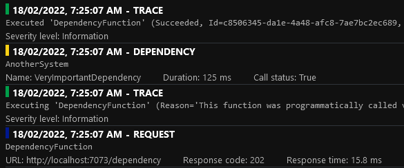

Navigate to <http://localhost:7074/dependency> (Custom in-process `v4`) in your favourite browser.

Only the request is recorded:

- The _Executing ..._ and _Executed ..._ traces have been discarded by the `FunctionExecutionTracesFilter`
- The custom dependency we've manually tracked has been discarded by the `CustomHttpDependencyFilter`

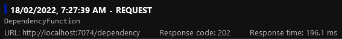

Isolated mode supports telemetry processors (except for request telemetry items). Navigate to <http://localhost:7075/dependency>.

Four telemetry items are recorded:

- The request itself
- The _Executing ..._ and _Executed ..._ traces
- The Invoke dependency (the host calling our Function)
- The custom dependency we've manually tracked has been discarded by the `CustomHttpDependencyFilter`

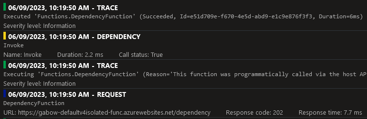

The `CustomHttpDependencyFilter` discards a specific telemetry type. This is useful when having a noisy dependency. You can tweak the processor to only discard successful or fast dependencies.

:rotating_light: Discarding telemetry items skews the statistics. Consider using [sampling][adaptive-sampling] instead.

## HealthFunction

To keep Function Apps on a consumption plan alive and limit the number of cold starts, I tend to use Application Insights [URL ping test][url-ping-test]. This results in many requests being recorded in Application Insights.

:memo: `HEAD` is more commonly used than `GET` for ping tests but it is easier to issue a `GET` with a web browser.

Navigate to <http://localhost:7073/health> (Default in-process `v4`) in your favourite browser. The Health request is recorded in Application Insights.

Navigate to <http://localhost:7074/health> (Custom in-process `v4`) in your favourite browser. The Health request is discarded by the `HealthRequestFilter` which is configured by the application setting `ApplicationInsights:HealthCheckFunctionName`.

Navigate to <http://localhost:7075/health> (Isolated `v4`) in your favourite browser. The Health request is recorded in Application Insights despite having a telemetry processor attempting to discard it. This is because request telemetry items are emitted by the host and the `HealthRequestFilter` applies to the worker.

## HttpExceptionThrowingFunction

Navigate to <http://localhost:7073/http-exception> (Default `v4`) in your favourite browser.

Demonstrates that the stack trace is not present in the console logs when an exception is thrown.

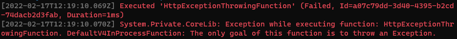

This also proves that the same exception appears twice in Application Insights:

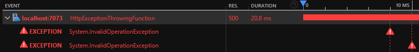

Navigate to <http://localhost:7074/http-exception> (Custom `v4`) in your favourite browser.

Demonstrates that the stack trace is present in the console logs when an exception is thrown.

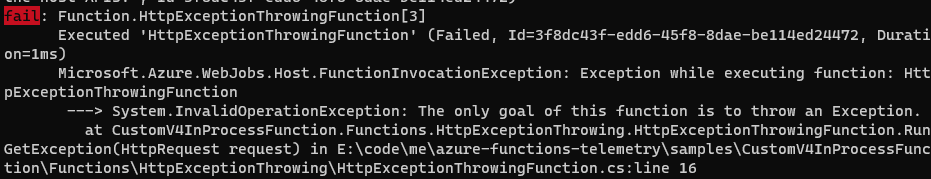

This also proves that the same exception appears only once in Application Insights:

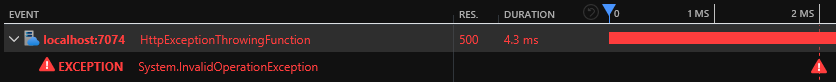

Navigate to <http://localhost:7075/http-exception> (Isolated `v4`) in your favourite browser.

The stack trace is present in the console logs when an exception is thrown (this is a welcome improvement).

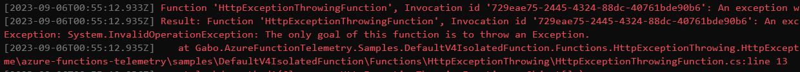

The same exception appears twice in Application Insights. Note that this is an `RpcException` thrown by the host, which makes the _Problem Id_ useless for filtering.

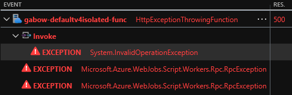

## ProcessorFunction

Navigate to <http://localhost:7073/processor> (Default `v4`) in your favourite browser.

Demonstrates that our `TelemetryCounterProcessor` telemetry processor is not being called even though I added it using `AddApplicationInsightsTelemetryProcessor`.

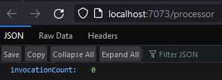

Navigate to <http://localhost:7074/processor> (Custom `v4`) in your favourite browser.

Demonstrates that our `TelemetryCounterProcessor` telemetry processor is being called:

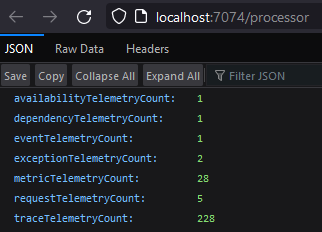

Note that the processor is also called for request telemetry items. When running in Azure you might get different results on each request as you might be hitting different instances and the state is kept in-memory.

Unfortunately, our `TelemetryCounterProcessor` is called for all telemetry item types except for requests for the Isolated `v4` Function (<http://localhost:7075/processor>):

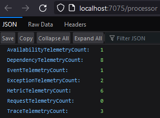

## ServiceBusFunction

You can send a message to the `defaultv4inprocess-queue` queue using the Service Bus Explorer in the Azure Portal or you can navigate to <http://localhost:7073/service-bus> (Default `v4`) in your favourite browser.

The Default Function does not have a _URL_ or a _Response code_:

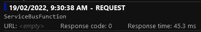

Four telemetry items are recorded for the Default Function execution:

- The request itself
- The _Executing ..._ and _Executed ..._ traces
- The _Trigger Details ..._ trace

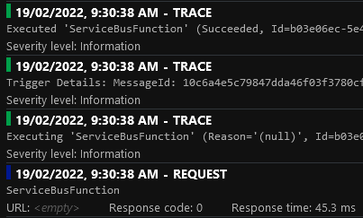

You can send a message to the `customv4inprocess-queue` queue using the Service Bus Explorer in the Azure Portal or you can navigate to <http://localhost:7074/service-bus> (Custom `v4`) in your favourite browser.

The Custom Function has both the _Request URL_ and _Response code_ set by `ServiceBusRequestInitializer`:

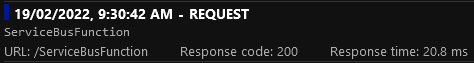

Only the request is recorded for the Custom Function execution:

- The _Executing ..._ and _Executed ..._ traces have been discarded by the `FunctionExecutionTracesFilter`
- The _Trigger Details ..._ trace has been discarded by the `ServiceBusTriggerFilter` (configured by setting the application setting `ApplicationInsights:DiscardServiceBusTrigger`)

You can send a message to the `defaultv4isolated-queue` queue using the Service Bus Explorer in the Azure Portal or you can navigate to <http://localhost:7075/service-bus> (Isolated `v4`) in your favourite browser.

The Default Isolated Function does not have a _URL_ or a _Response code_:

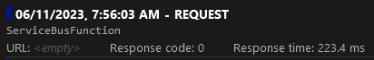

Five telemetry items are recorded for the Default Isolated Function execution:

- The request itself
- The _Executing ..._ and _Executed ..._ traces
- The _Trigger Details ..._ trace
- The Invoke dependency (the host calling our Function)

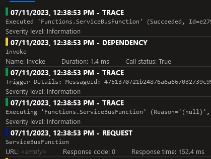

## ServiceBusExceptionThrowingFunction

You can send a message to the `defaultv4inprocess-exception-queue` queue using the Service Bus Explorer in the Azure Portal or you can navigate to <http://localhost:7073/service-bus-exception> (Default `v4`) in your favourite browser.

Demonstrate that a single exception thrown by the Function is recorded three times in Application Insights and that a total of nine telemetry items are emitted during the Function execution.

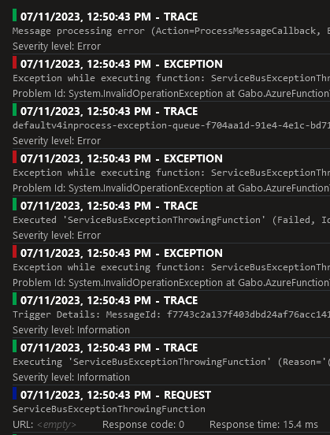

You can send a message to the `customv4inprocess-exception-queue` queue using the Service Bus Explorer in the Azure Portal or you can navigate to <http://localhost:7074/service-bus-exception> (Custom `v4`) in your favourite browser.

Demonstrate that a single exception thrown by the Function is recorded only once in Application Insights and that a total of three telemetry items are emitted during the Function execution.

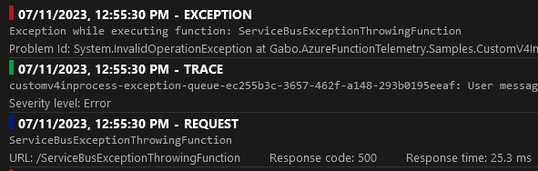

You can send a message to the `defaultv4isolated-exception-queue` queue using the Service Bus Explorer in the Azure Portal or you can navigate to <http://localhost:7075/service-bus-exception> (Isolated `v4`) in your favourite browser.

Demonstrate that a single exception thrown by the Function is recorded four times in Application Insights and that a total of eleven telemetry items are emitted during the Function execution.

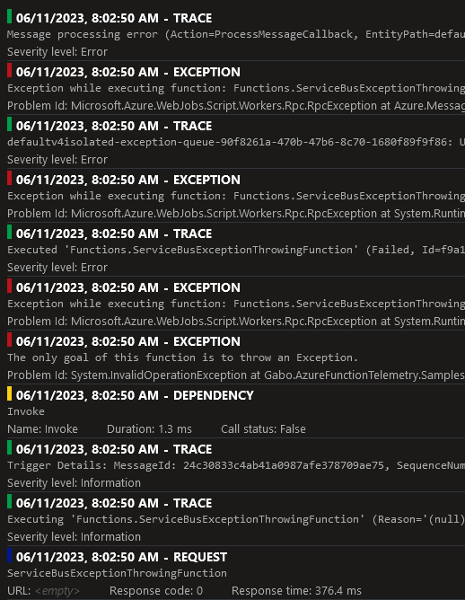

## TraceLogFunction

Navigate to <http://localhost:7073/trace-log> (Default `v4`) / <http://localhost:7074/trace-log> (Custom `v4`) / <http://localhost:7075/trace-log> (Isolated `v4`) in your favourite browser.

Demonstrate that log events are not filtered before being sent to Live Metrics. This is not a limitation of Azure Functions, that's how Application Insights works and something you need to be aware of.


## UserSecretFunction

Navigate to <http://localhost:7073/secret> (Default `v4`) / <http://localhost:7074/secret> (Custom `v4`) / <http://localhost:7075/secret> (Isolated `v4`) in your favourite browser.

Demonstrates that Azure Functions can use the [Secret Manager][secret-manager] when running locally.

## Application Version and Cloud Role Name

By default, the _Application Version_ is not set, and the _Cloud Role Name_ will be the Function App Azure resource name:

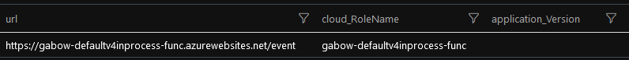

For the custom Function, each telemetry will be stamped with the Assembly Informational Version and the configured application name:

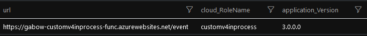

## Discarding SystemTraceMiddleware logs

The `SystemTraceMiddleware` emits two log events per HTTP Function execution when running an **in-process** v4 Function locally:

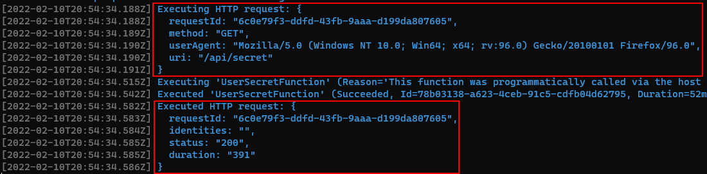

These can be suppressed by adding the below `Value` to `local.settings.json` (not `host.json`):

```json
"logging:logLevel:Microsoft.Azure.WebJobs.Script.WebHost.Middleware.SystemTraceMiddleware": "None"
```

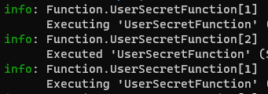

Anthony Chu has [documented how to suppress some logs][anthony-chu-suppress-logs].

[azurite]: https://learn.microsoft.com/en-us/azure/storage/common/storage-use-azurite
[azure-functions-core-tools]: https://github.com/Azure/azure-functions-core-tools
[powershell-7]: https://learn.microsoft.com/en-us/powershell/azure/install-azure-powershell
[azure-powershell]: https://learn.microsoft.com/en-us/powershell/azure/install-az-ps?view=azps-9.4.0
[dont-call-add-app-insights-telemetry]: https://learn.microsoft.com/en-us/azure/azure-functions/functions-dotnet-dependency-injection#logging-services
[secret-manager]: https://learn.microsoft.com/en-us/aspnet/core/security/app-secrets?view=aspnetcore-6.0&tabs=windows#secret-manager
[default-telemetry-configuration-registration]: https://github.com/gabrielweyer/azure-functions-telemetry/blob/81a44091df4263442bb0e205a3942cfa5bfedb70/src/AzureFunctionsTelemetry/ApplicationInsights/ApplicationInsightsServiceCollectionExtensions.cs#L231-L235
[url-ping-test]: https://learn.microsoft.com/en-us/azure/azure-monitor/app/availability-overview
[anthony-chu-suppress-logs]: https://github.com/anthonychu/functions-log-suppression#readme
[postman-collection]: postman/FunctionsTelemetry.postman_collection.json
[bicep-cli]: https://learn.microsoft.com/en-au/azure/azure-resource-manager/bicep/install#install-manually
[adaptive-sampling]: https://learn.microsoft.com/en-us/azure/azure-monitor/app/sampling#adaptive-sampling
